Graded Assignment : CI/CD Pipeline

Jenkins + EC2 Node + Direct Flask Deployment (No Virtual Env)

Application contains
    app.py
    requirements.txt
    test_app.py
    Jenkinsfile

1. EC2 INSTANCE CREATION
    Step 1: Launch EC2

        Go to AWS Console
        Navigate to EC2
        Click Launch Instance

        Configuration:

        AMI	Ubuntu Server               22.04 LTS
        Instance Type	                t2.micro
        Key Pair	                    Create new or use existing
        Network	                        Default VPC
        Auto-assign Public IP	        Enabled

    Step 2: Security Group Configuration

    Create a new Security Group with:

    Type	        Port	        Source
    SSH	            22	            0.0.0.0/0
    HTTP	        80	            0.0.0.0/0
    Custom TCP	    5000	        0.0.0.0/0

    Why:

    22 → SSH access
    80 → Web access (future production)
    5000 → Flask app runs on 5000

    Launch instance.

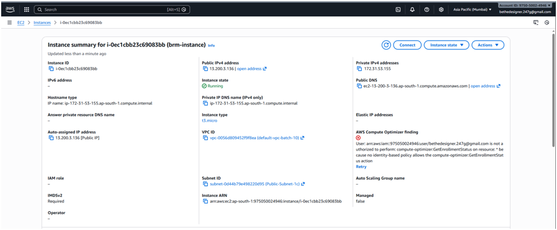
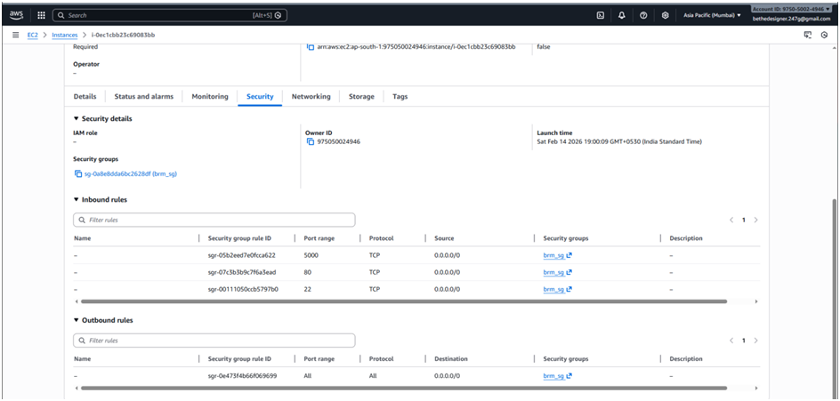

2. CONNECT TO EC2
    ssh -i your-key.pem ubuntu@<public-ip>
3. INSTALL REQUIRED PACKAGES ON EC2

    sudo apt update
    sudo apt upgrade -y
    sudo apt install python3 python3-pip -y
    sudo apt install git -y
    sudo apt install openjdk-17-jdk -y

4. ADD EC2 AS JENKINS NODE (AGENT)
    Go to:

        Manage Jenkins → Nodes → New Node

    Configuration:

        Node Name	    ec2-node
        Type	        Permanent Agent

        Click OK.

    Agent Configuration

        Remote root directory	    /home/ubuntu
        Labels	                    ec2
        Usage	                    Only build jobs with label expressions matching this node
        Launch method	            Launch agent via SSH
    
    SSH Configuration :

        Click Add Credentials

        Kind: SSH Username with Private Key

        ID: ec2-ssh

        Username: ubuntu

        Private Key: Paste your .pem key

        Save.

        Select this credential in Node config.

        Save node.

        Click → Launch Agent.

        Agent should connect successfully.

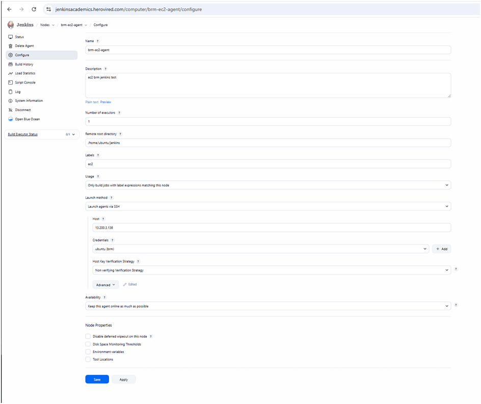

5. GITHUB CREDENTIALS

Manage Jenkins → Credentials → Global → Add Credentials

    Kind: Username with Password

    Username: GitHub username

    Password: GitHub Personal Access Token

    ID: github-creds

    Save.

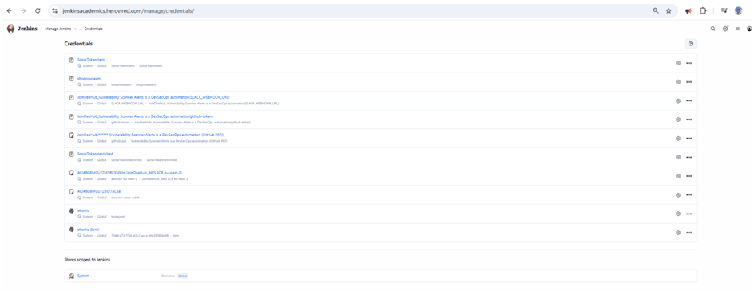
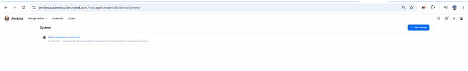
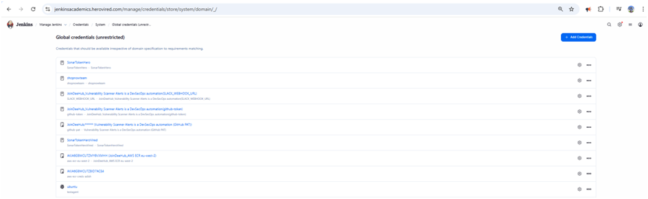
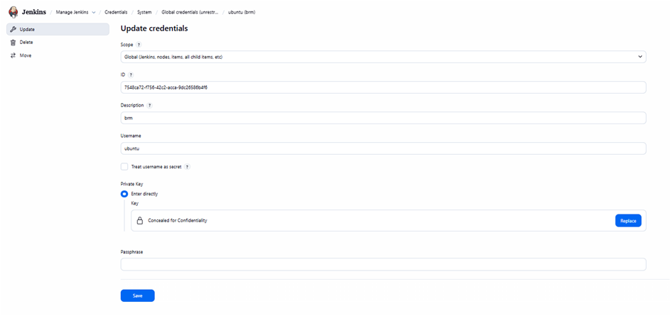

6. Jenkins system setup for email configuration

    Goto Manage Jenkins - system - Email notification
    and choose the settings as per the image below, generate an application password from google to use here.

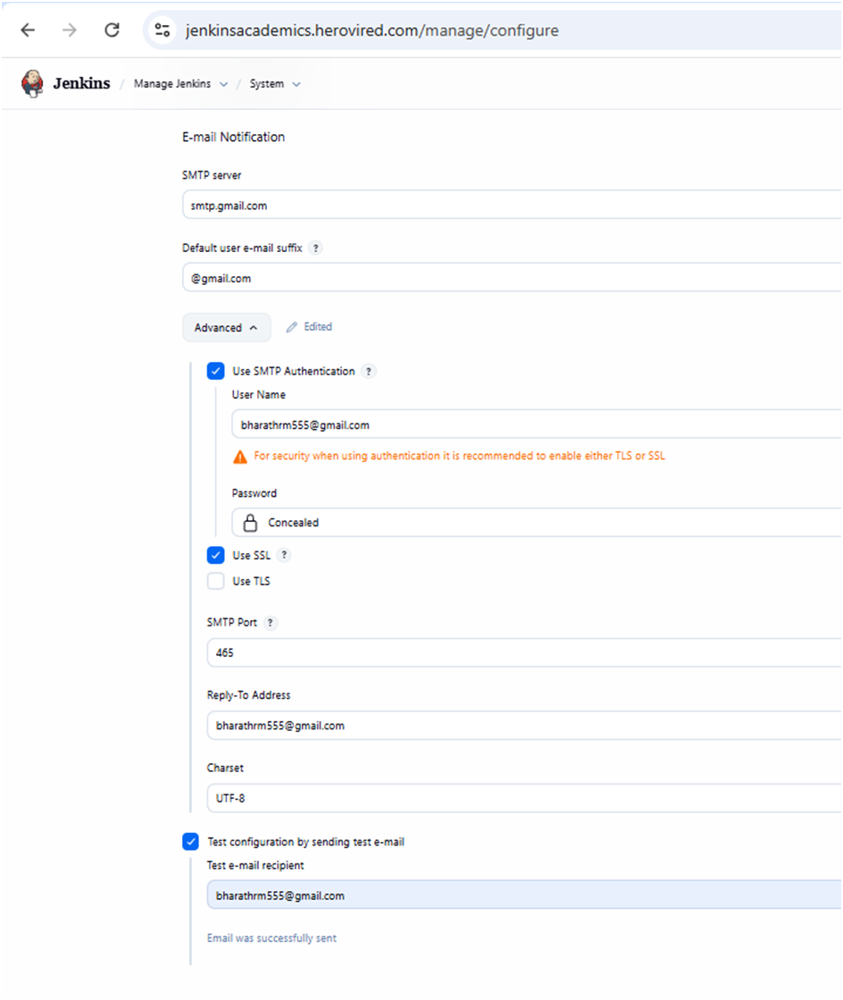

6. PIPELINE CREATION

    Dashboard → New Item
    Select → Pipeline
    Name → flask-app
    And follow along the images for configuraations and click build once they are pushed to github.

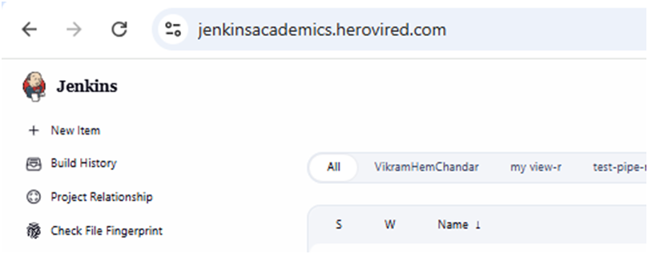
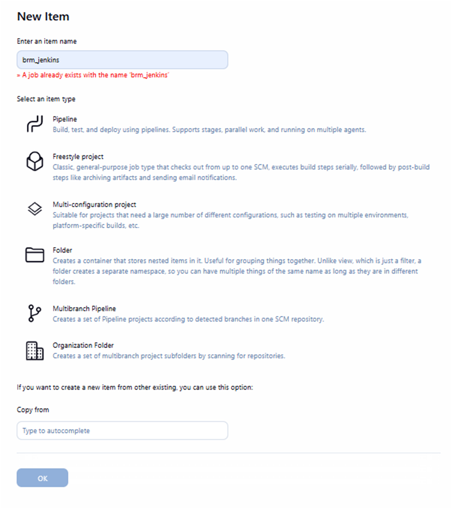
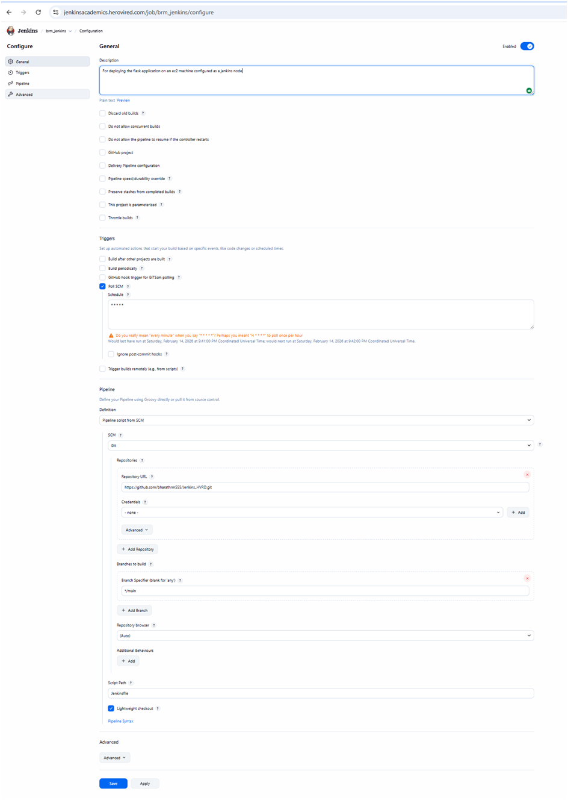

7. Testing the pipline for CD

    a. First run we will keep the changes and run it and we can access the application from our EC2 instance public ip with port 5000 on a browser.

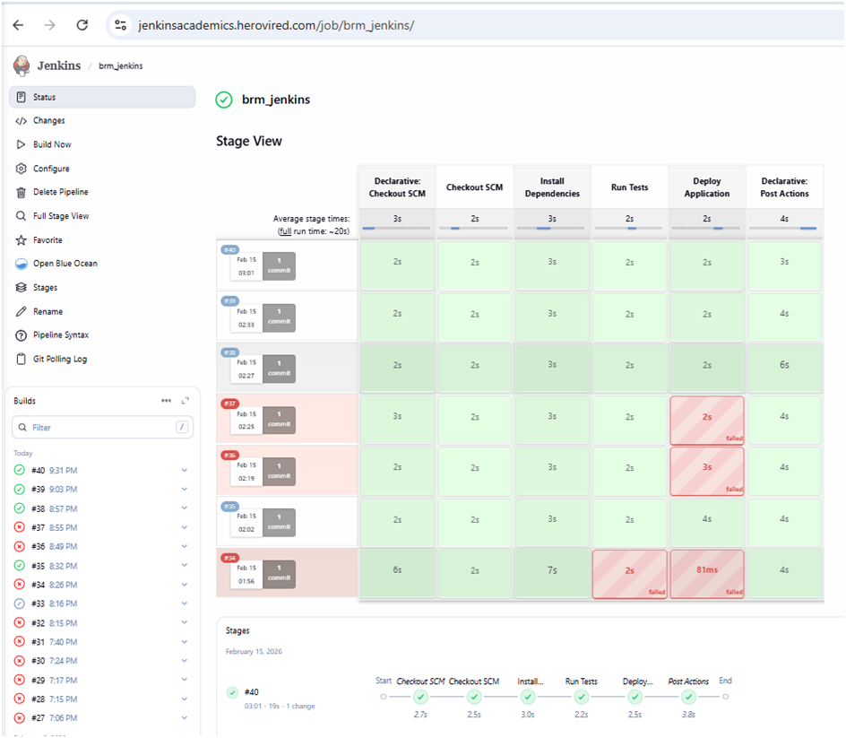
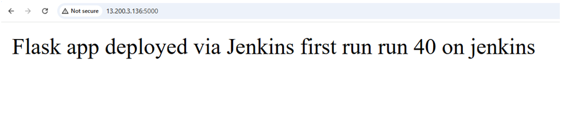

    b. Second run we will slightly change the application code and push the codes to github and the Jenkins should automatically poll it from the github and rerun the pipeline and redeploy the changes, here we have used a polling methods from jenkins so Jenkins will keep on polling form github for changes, but if we want github to notify the changes immediately when someone pushes codes to github we need to use webhooks method and its efficient in saving time and triggers the pipeline right after the changes are pushed.

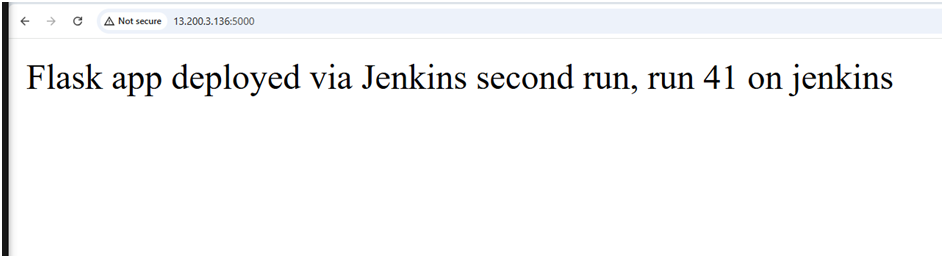

8. Verification and troubleshooting

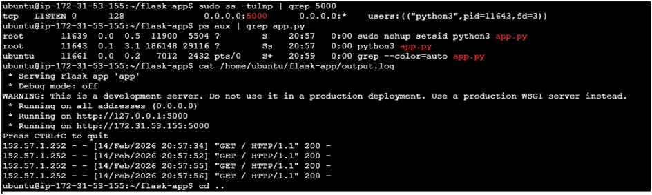